# Important Links & Dates

- **Application Deadline:** February 21st, 2021 (see below for details)
- **Final Decision Notification:** March 1st, 2021
- **1-Day Workshop:** 15 May JST 2200 – 16 May JST 0200 / 15 May EDT 0900-1300 / 15 May CEST 1500-1900

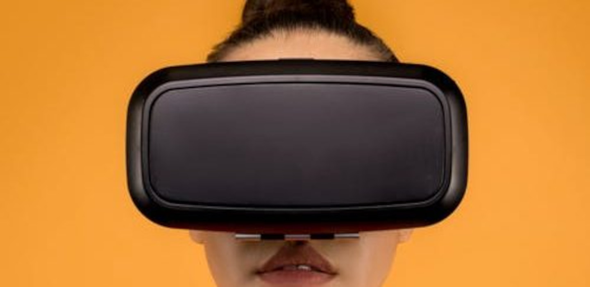

# About the first CHI remote XR research workshop

HCI and social science experimentation that explores or uses extended reality (XR) has been particularly impacted by the recent Covid-19 pandemic. This is due to typical deployment of XR experiments inside laboratories, and a paucity of research into how to effectively conduct remote XR experimentation. This first CHI Remote XR workshop aims to explore the current state of the art around three main themes of remote XR experimentation:

1. participant recruitment and screening;
1. data collection, including limitations and affordances of existing research and XR tools
1. software frameworks and requirements for the effective design of encapsulated remote XR user studies.

This workshop brings together researchers and practitioners in XR to explore these recently emerged themes and to imagine how effective future remote XR research might be conducted.

# Workshop Themes

## Participants: who are they, are they representative, and how do weaccess them?

The recruitment of online participants for non-XR experiments is generally considered effective, and often happens through platforms such as Amazon Mechanical Turk. While this approach has been used for XR studies, the use of XR-specific hardware has limited the participant pool (e.g. only 1.4% of Amazon Mechanical Turk respondents have access to head-mounted VRdisplays).

Participants also may have to have access to a dedicated physical space (e.g. devices usually require an empty 2×2 metres, while AR experiments may need fixed locations), as well as other common experimental requirements (e.g. no distractions).

This limited participant pool raises two questions: is it representative of wider populations, and how do we effectively access this smaller pool of users? To answer this, we need a better idea of who these users are and how to target them. In addition, it is important to understand ethical concerns of using participants in different countries and within different cultural/social/physical environments.

## Data collection: identifying drawbacks of remote XR and advantages from the data collection affordances built-in to XR hardware

Laboratory settings allow researchers to setup and capture many different types of data from a participant, which have previously not been practical for remote XR studies (e.g. physiological data, external cameras, bespoke hardware interactions). It is reasonable to suggest that remote XR experiments are not yet able to easily recreate this level of data collection.

However, modern XR-enabling hardware (such as consumer VR kits) allow for many types of data collection that were previously difficult to collect or required bespoke setups. Different variations of XR-hardware also enable further data collection (such as HMDs with in-built eye-tracking).

There are also novel approaches to understanding human activity that are possible via XR-hardware that have previously used dedicated sensors, such as using microphones to measure exercise exertion or body or head movements for focus on interest and interactional attention.

We believe it is important for the XR research community to outline both the limitations and potential of existing XR-hardware, as well as imagine what an idealised XR-hardware-as-data-collection device might look like.

## Encapsulated studies: how can we lower the barriers to creating encapsulated experiment software, to maximise the potential of remote XR research

Software applications for XR development have been traditionally developed with the assumption of lab-based experimentation. Work is being done to simplify the data collection step for XR experiments built in Unity.

However, there is not yet an approach that is dedicated to the requirements of remote studies. In fact, we still need to establish the requirements for the development of a software framework that allows the effective implementation of remote XR studies.

This should not only include the data collection methods, but also libraries to transfer and store the data safely and easy-to-setup environments to run studies. This type of “encapsulated experiment” could also improve replication and transparency, as theorised by Blascovich, and allow for versioning of experiments, in which researchers can build on perfect replicas of other’s experimental environments and processes.

Questions remain over what are the constant features that should be at the core of most XR remote research and that should necessarily be present and available for researches who want to deploy a remote XR user study.

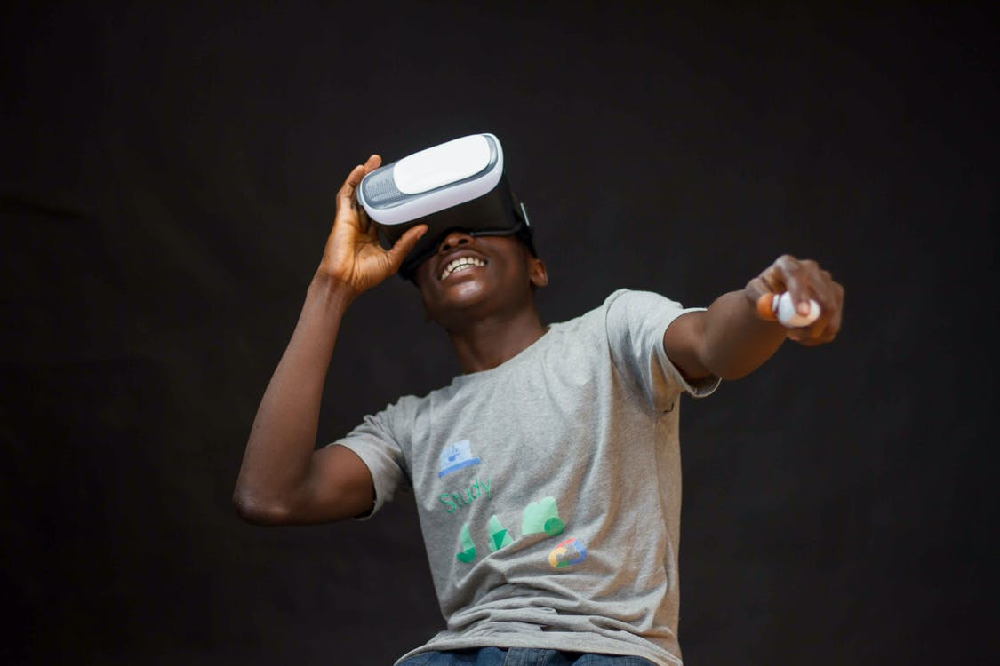

# Call for Participation

Research experiments in the XR/MR/VR field has traditionally taken place in dedicated space and laboratories and been supervised by the researcher. With COVID-19, the sudden transition to remote experimentation has left many researchers without opportunities to carry on their user studies. This is partially due to the lack of remote-oriented solutions for XR research.

This workshop will bring together researchers and practitioners in XR research with the goals to:

- Reflect on the limitations of current participant recruitment for remote XR studies, and the requirements for effective on-going recruitment
- Identify the characteristics of existing XR research and explore the opportunities XR hardware brings to remote experimentation, as well as what other features might be implemented with a “research-oriented” approach
- Discuss the needs of a standardized software framework to conduct encapsulated remote XR experimentation and the benefits it might bring

*Participants should submit position papers (max 3 pages in [CHI ACM Master Article format](https://chi2021.acm.org/for-authors/chi-publication-formats)) about their XR research and practice addressing the themes listed at the workshop website*. Position paper submission is to [f.soave@qmul.ac.uk](mailto:f.soave@qmul.ac.uk). Participants will be selected based on the quality of XR research and practice and with a view to creating a balance of topics in the workshop.

Please note that at least one author of each accepted position paper must attend the workshop and that all participants must register for both the workshop and for at least one day of the CHI 2021 conference.

# Workshop Structure

| Activity | Time (minutes) | Description |
| --- | --- | --- |
| Welcome | 10 | Workshop introduction |
| Session 1 | 45 | Discuss remote participant recruitement and the prototyping of a dedicated platform or process |
| Coffee Break | 15 | |
| Session 2 | 45 | Discuss the need an limitations for remote XR data collection, and affordances of XR hardware devices |
| Lunch Break | 30 | |
| Session 3 | 45 | Discuss software frameworks to be used by researchers for encapsulated remote XR experimentation |
| Conclusion | 10 | Summary |

The workshop is designed to provide an opportunity for researchers to discuss the needs and limitations of remote XR practice. The aim, broadly, is to collaboratively imagine practical futures for idealised remote XR research processes, and outline the requirements to reach these.The workshop will take place in an online environment as a virtual activity during the conference.

The structure of the workshop is summarised in the image above, and consists of three sessions, one for each theme outlined above: participant recruitment, XR hardware and data collection, and encapsulated experiments.

Each of the first two sessions consist of two sprints: the first for discussing relevant prevalent challenges, and the second for imagining ways to overcome these. In each sprint, participants will be split into two breakout rooms to allow for more intimate, involved discussions. At the end of a sprint, the groups will reconvene to share results.

The third session is an open discussion, partially based on learnings from the first two, and leveraging a cooperative shared annotation space for sharing and arranging ideas. The workshop will take place in a normal video conferencing application and additional platforms will be used for the interactive activities (e.g. Miro, Mural or Google slides). The total duration of the workshop, including breaks, will be 3.5 hours.

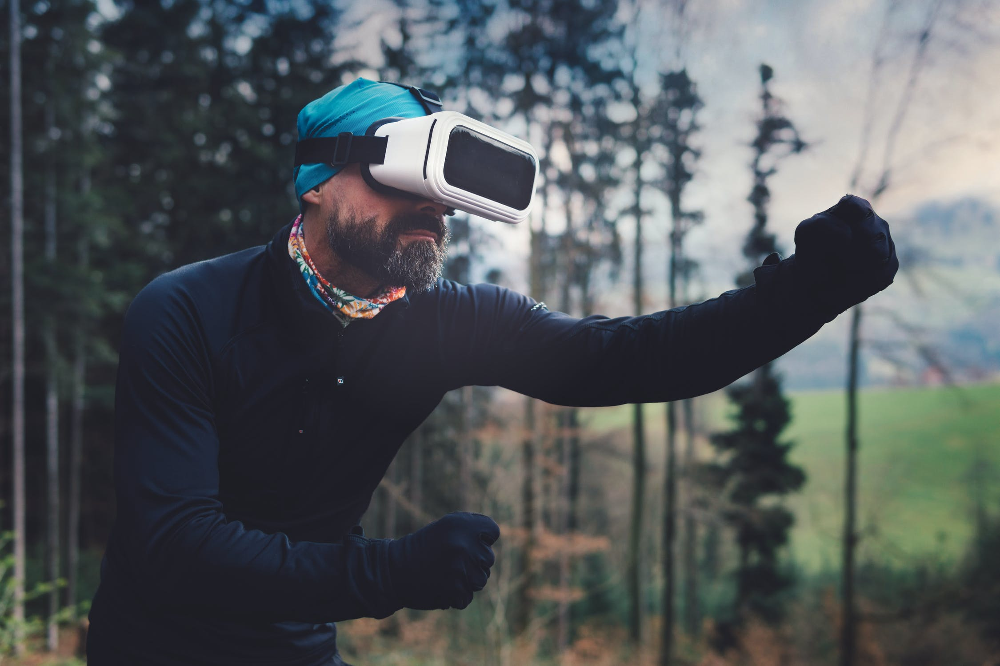

# Post-Workshop Plans

Our aim for the workshop is to collect the needs and limitations of current XR research practices and to imagine how the future research in this field could be. With the information collected during the workshop we will:

- Circulate notes created in the workshop with participants
- Propose guidelines for the design of future research-oriented XR hardware, software frame-works and deployment platforms for remote XR user studies
- Prepare a journal paper on the themes of the workshop

# Workshop Presentations

| &nbsp;&nbsp;&nbsp;&nbsp;&nbsp;&nbsp;&nbsp;&nbsp;&nbsp;&nbsp;&nbsp;&nbsp;&nbsp;&nbsp;&nbsp;&nbsp;&nbsp;&nbsp;&nbsp;&nbsp;&nbsp;&nbsp;&nbsp;&nbsp;&nbsp;&nbsp;&nbsp;&nbsp;&nbsp;&nbsp;&nbsp;&nbsp;&nbsp;&nbsp;&nbsp;&nbsp;&nbsp;&nbsp;&nbsp;&nbsp;&nbsp;&nbsp;&nbsp;&nbsp;&nbsp;&nbsp;&nbsp;&nbsp;&nbsp;&nbsp;&nbsp;&nbsp;&nbsp;&nbsp;&nbsp;&nbsp;&nbsp;&nbsp;&nbsp;&nbsp;&nbsp;&nbsp;&nbsp;&nbsp;&nbsp;&nbsp;&nbsp;&nbsp;&nbsp;&nbsp;&nbsp;&nbsp;&nbsp;&nbsp;&nbsp;&nbsp;&nbsp;&nbsp;&nbsp;&nbsp;&nbsp;&nbsp;&nbsp;&nbsp;&nbsp;|  |
| --- | --- |
| 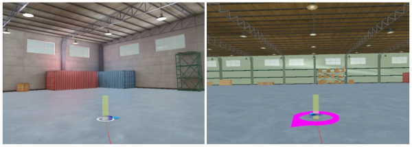 | **Ensuring the Reliability of Remote VR Research Data**. Melynda Hoover, Lucia Cherep, Jonathan Kelly, Stephen Gilbert [presentation](https://www.youtube.com/watch?v=tcVIXldH3xs) |
| 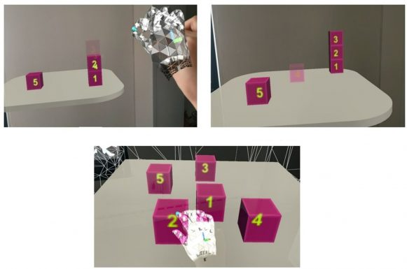 | **Model-based Task Analysis and Large-scale Video-based Remote Evaluation Methods for Extended Reality Research**. Yalda Ghasemi, Heejin Jeong [presentation](https://www.youtube.com/watch?v=Olc2LomZRG8) |
| 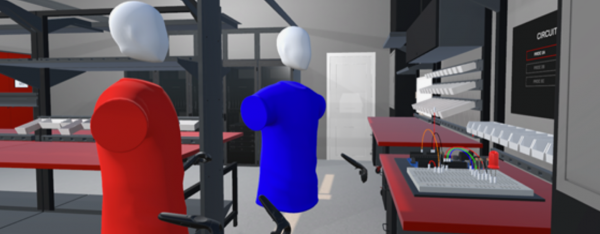 | **Adaptive Moderated Research: Lessons Learned in Redesigning a Moderated Virtual Reality Collaboration Study**. Kaitlyn Ouverson, Angelica Jasper,Stephen B. Gilbert, Nick Wilson, Peggy Wu [presentation](https://www.youtube.com/watch?v=nHipBhIcQPY) |
| 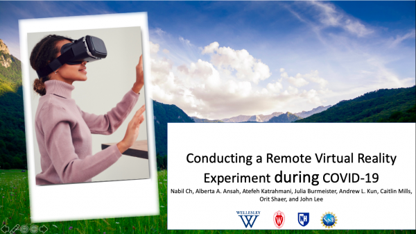 | **Conducting a Remote Virtual Reality Experiment during COVID-19**. Nabil Ch, Alberta A. Ansah, Atefeh Katrahmani, Julia Burmeister, Andrew L. Kun, Caitlin Mills, Orit Shaer, John Lee [presentation](https://www.youtube.com/watch?v=_O-UGJ33YNA) |
| 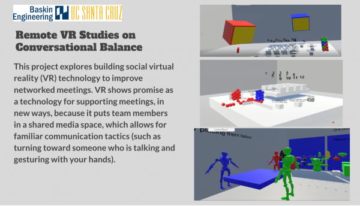 | **Challenges in Running Social VR Studies. A Tale of a Covid Procedural Pivot**. Victor Jialang Li, Sean Fernandes, Joshua Mcveigh-Schultz, Kathering Isbister [presentation](https://www.youtube.com/watch?v=E0y2nTWkhYA) |
| 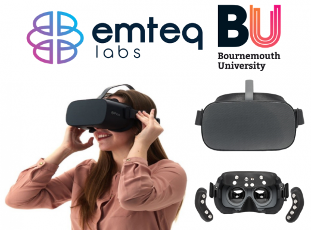 | **Remote Collection of Physiological Data in a Virtual Reality Study**. Michal M.G. Gnacek, Ellen E.S. Seiss, Theodoros T.K. Kostoulas, Emili E.B. Balaguer-Ballester, Charles C. Nduka [presentation](https://www.youtube.com/watch?v=1snh2wMsHHM) |
| 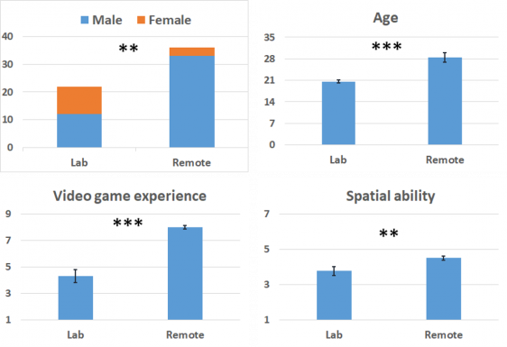 | **Reflections on Remote XR Experiments During the COVID-19 Pandemic**. Pejiman Sajjadi, Jiayan Zhao, Jan Oliverwallgrun, Mahda M. Bagher, Alexander Klippel [presentation](https://www.youtube.com/watch?v=QtewAKSSAZw) |
| 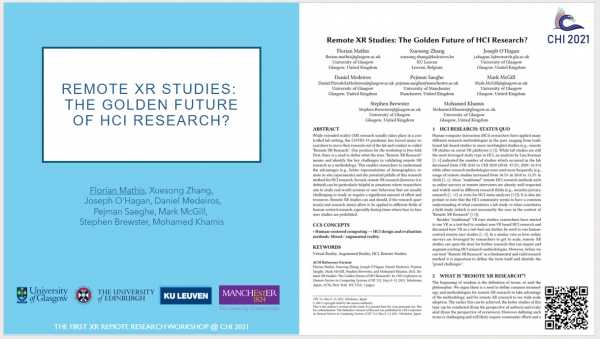 | **Remote XR Studies: The Golden Future of HCI Research?** Florian Mathis, Xuesong Zhang, Joseph O’Hagan, Daniel Medeiros, Pejman Saeghe, Mark Mcgill, Stephen Brewster, Mohamed Khamis [presentation](https://www.youtube.com/watch?v=cY1uiOuebvI) |
| 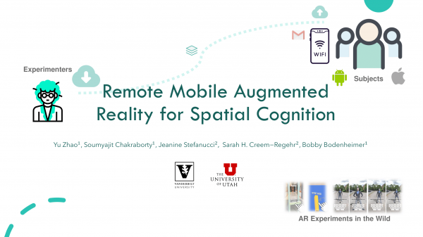 | **Remote Mobile Augmented Reality for Spatial Cognition**. Yu Zhao, Soumyajit Chakraborty, Jeanine Stefanucci, Sarah H. Creem-Regehr, Bobby Bodenheimer [presentation](https://www.youtube.com/watch?v=lckAL3xkdl0) |
| 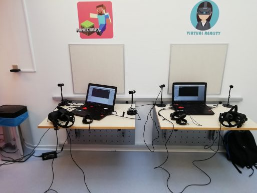 | **Remote Virtual Reality User Studies**. Louise Bryce, Mark Sandler [presentation](https://www.youtube.com/watch?v=2OcP6od10mo) |
| 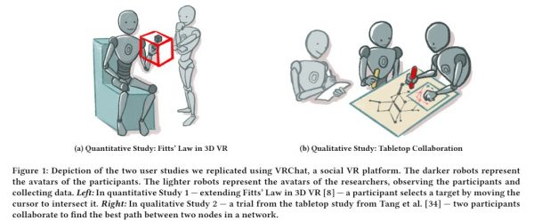 | **Two Paths Towards the Future of Remote Studies using Social VR**. David Saffo, Sara Di Bartolomeo, Liudas Panavas, Caglar Yildirim, Cody Dunn [presentation](https://www.youtube.com/watch?v=x5E47nqVBso) |
| | **Researchers’ and Participants’ Experiences on Distributed User Studies Conducted in the First Year of COVID-19 Pandemic**. Anil Ufuk Batmaz, Domenick Mifsud, Anthony Steed, Wolfgang Stuerzlinger, Francisco R. Ortega [presentation](https://youtu.be/NI4UYPdQKDw) |
| | **Some Lessons Learned Running Virtual Reality Experiments Out of the Laboratory**. Anthony Steed, Daniel Archer, Ben Congdon, Sebastian Friston, David Swapp, Felix J. Thiel [presentation](https://www.youtube.com/watch?v=x5E47nqVBso) |

# About

This workshop is organised by:

- Jack Ratcliffe, PhD candidate at Queen Mary, University of London
- Francesco Soave, PhD candidate at Queen Mary, University of London
- Melynda Hoover, PhD student at Iowa State University
- Dr. Francisco Ortega, Assistant Professor at Colorado State University
- Dr. Nick Brynn-Kinns, Professor at Queen Mary, University of London
- Laurissa Tokarchuk, Senior Lecturer at Queen Mary, University of London
- Ildar Farkhatdinov, Lecturer at Queen Mary, University of London

# Contact

Please contact [f.soave@qmul.ac.uk](mailto:f.soave@qmul.ac.uk) for questions.

